# PathFinder GPS — Architecture

> Last updated: 2026-10-02

---

## Table of Contents

1. [System Overview](#1-system-overview)
2. [Technology Stack](#2-technology-stack)
3. [Runtime Architecture](#3-runtime-architecture)
4. [Front-End Layer](#4-front-end-layer)
5. [Back-End Layer](#5-back-end-layer)
6. [Database Layer](#6-database-layer)
7. [External Services](#7-external-services)
8. [Feature: Route Tracking and Saving](#8-feature-route-tracking-and-saving)
9. [Feature: Route Sharing](#9-feature-route-sharing)
10. [Feature: Nearby Places Discovery (POI)](#10-feature-nearby-places-discovery-poi)
11. [Module Dependency Graphs](#11-module-dependency-graphs)
12. [CI/CD Pipeline](#12-cicd-pipeline)
13. [Environment Variables](#13-environment-variables)

---

## 1. System Overview

PathFinder GPS is a Progressive Web App (PWA) that records, maps, saves, and shares GPS routes in real-time. It also discovers nearby Points of Interest (POI) during active tracking sessions.

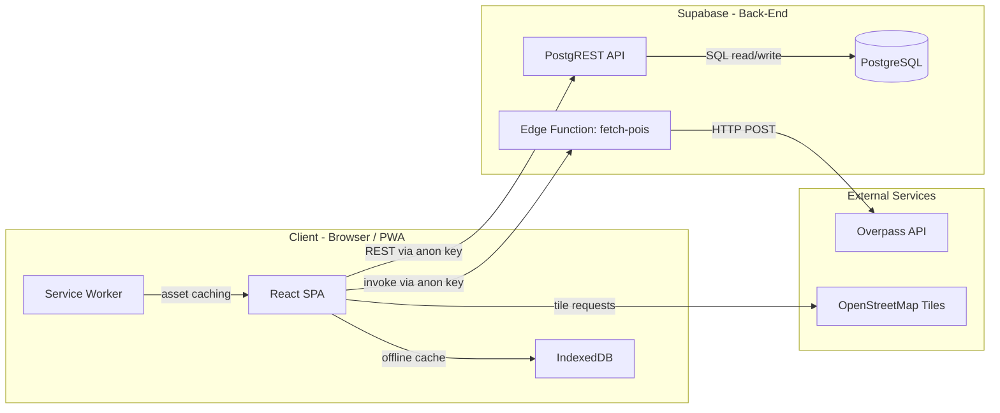

---

## 2. Technology Stack

| Layer | Technology | Version | Purpose |
|---|---|---|---|
| **UI Framework** | React | 19.x | Component rendering, state management |
| **Build Tool** | Vite | 8.x | Dev server, HMR, production bundling |
| **PWA** | vite-plugin-pwa (Workbox) | 1.x | Service worker, offline caching, manifest |
| **Map Rendering** | Leaflet + react-leaflet | 1.9 / 5.0 | Interactive map, polylines, markers, circles |
| **Icons** | lucide-react | 1.x | UI iconography |
| **BaaS** | Supabase | 2.x | Auth-free PostgreSQL, Edge Functions, REST API |
| **Database** | PostgreSQL (Supabase-hosted) | 15+ | Route persistence and geohash POI cache |
| **Edge Runtime** | Deno (Supabase Edge Functions) | — | Server-side Overpass requests and cache writes |
| **Basemap** | OpenStreetMap | — | Map tiles |
| **POI Data** | Overpass API (OpenStreetMap) | — | Nearby places querying |
| **Hosting** | Vercel | — | Static SPA hosting, CDN |
| **CI/CD** | GitHub Actions | — | Migrations, Edge Function deploy, Vercel deploy |

---

## 3. Runtime Architecture

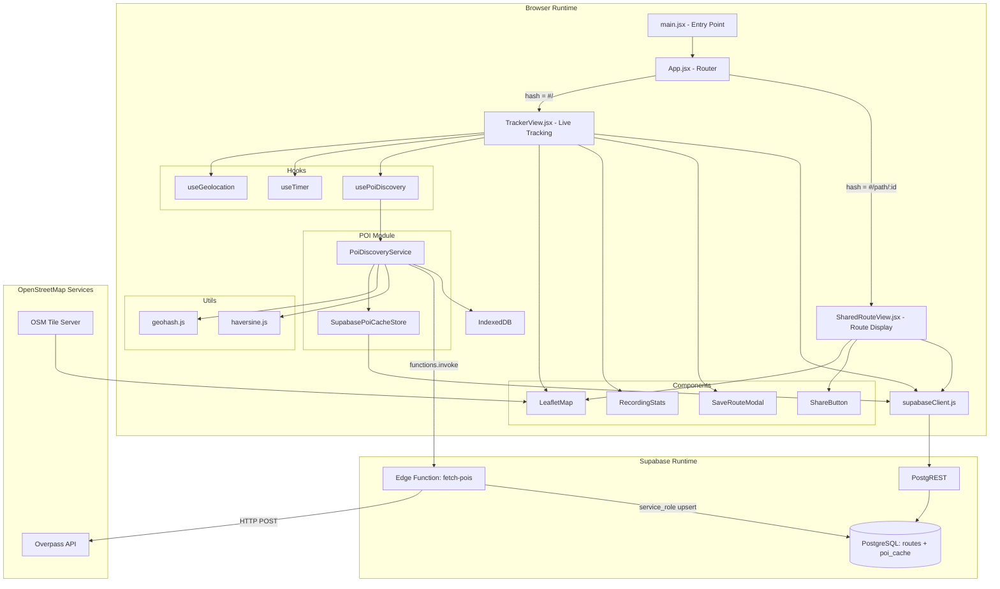

---

## 4. Front-End Layer

### 4.1 Entry Point

| File | Role |
|---|---|
| `index.html` | HTML shell, PWA meta tags, viewport config |
| `src/main.jsx` | React root and global CSS |
| `src/App.jsx` | Hash-based router: `#/` leads to TrackerView, `#/path/:id` leads to SharedRouteView |

### 4.2 Views

| View | File | Responsibility |
|---|---|---|
| **TrackerView** | `src/views/TrackerView.jsx` | Live GPS tracking, recording controls, POI wiring, save-to-Supabase flow |
| **SharedRouteView** | `src/views/SharedRouteView.jsx` | Fetches a saved route by UUID, displays static map + stats + share button |

### 4.3 Components

| Component | File | Responsibility |
|---|---|---|
| **LeafletMap** | `src/components/Map/LeafletMap.jsx` | Renders OpenStreetMap tiles, route polylines, GPS dot, start/end pins, POI markers, and POI radius circle. |
| **RecordingStats** | `src/components/RecordingStats.jsx` | Displays duration, distance, average speed during active tracking |
| **SaveRouteModal** | `src/components/SaveRouteModal.jsx` | Modal dialog for naming and saving a recorded route |
| **ShareButton** | `src/components/ShareButton.jsx` | Native Web Share API with clipboard fallback |

### 4.4 Hooks

| Hook | File | Responsibility |
|---|---|---|
| **useGeolocation** | `src/hooks/useGeolocation.js` | `watchPosition` with noise filtering (accuracy over 50m rejected, under 1m movement ignored), mock GPS simulator mode, path accumulation |
| **useTimer** | `src/hooks/useTimer.js` | Elapsed time counter (1s interval), start/stop/reset |
| **usePoiDiscovery** | `src/hooks/usePoiDiscovery.js` | React wrapper around `PoiDiscoveryService`, translates position updates into reactive `pois` array, resets on tracking stop |

### 4.5 Utilities

| File | Exports | Purpose |
|---|---|---|
| `src/utils/haversine.js` | `getDistance()`, `getPathDistance()` | Haversine-formula geodesic distance calculations |
| `src/utils/geohash.js` | `encodeGeohash()`, `decodeGeohash()`, `getGeohashNeighbors()` | Pure-JS geohash encoding/decoding and 8-neighbor cell computation |

### 4.6 Services

| File | Export | Purpose |
|---|---|---|
| `src/services/supabaseClient.js` | `supabase` | Singleton Supabase client initialized with `VITE_SUPABASE_URL` and `VITE_SUPABASE_PUBLISHABLE_KEY` |

### 4.7 Map Strategy

The app renders OpenStreetMap tiles through Leaflet and fetches POIs through the Overpass API from the Supabase Edge Function. No Google Maps key or map ID is required.

---

## 5. Back-End Layer

### 5.1 Supabase PostgREST API

The front-end communicates with Supabase PostgreSQL through the auto-generated REST API using the **anon (publishable) key**. No authentication is required — both `anon` and `authenticated` roles have permissions.

| Operation | Table | Role | Method |
|---|---|---|---|
| Insert route | `routes` | anon | `POST` |
| Read route by ID | `routes` | anon | `GET` with `.eq('id', routeId).single()` |
| Read POI cache | `poi_cache` | anon | `GET` with `.in('geohash', [...])` |

### 5.2 Edge Function: fetch-pois

| Property | Value |
|---|---|
| **File** | `supabase/functions/fetch-pois/index.ts` |
| **Runtime** | Deno (Supabase Edge Functions) |
| **Auth** | `--no-verify-jwt` (no auth required to invoke) |
| **Input** | `{ geohash, lat, lng, radiusMeters, ttlSeconds }` |
| **Steps** | 1. Validate request, 2. Build Overpass QL, 3. POST to Overpass, 4. Normalize results, 5. Upsert `poi_cache` with service role, 6. Return `{ pois }` |

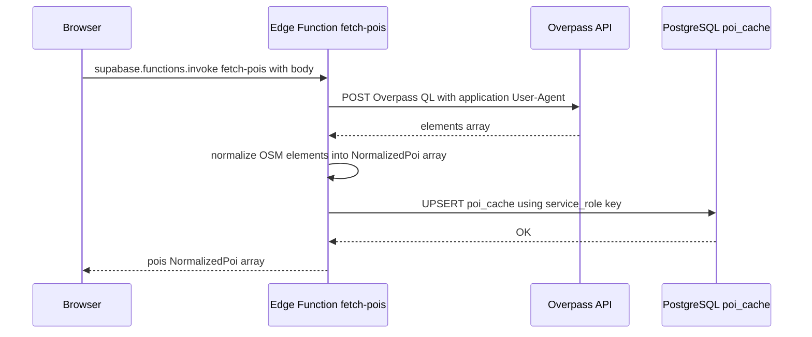

**Why the Edge Function exists**: Overpass requires a custom `User-Agent`, and cache writes must use the Supabase service-role key. Both remain server-side; clients only read cached geohash rows.

---

## 6. Database Layer

### 6.1 Schema Diagram

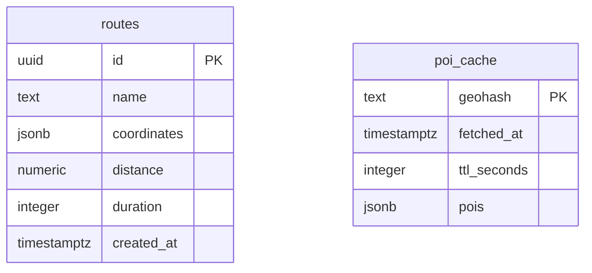

**routes** columns:
- `id` — UUID primary key, auto-generated via `gen_random_uuid()`
- `name` — NOT NULL, user-given route name
- `coordinates` — NOT NULL, JSONB array of `{lat, lng, timestamp}` objects
- `distance` — NOT NULL, total distance in meters
- `duration` — NOT NULL, total duration in seconds
- `created_at` — defaults to `now()` in UTC

**poi_cache** columns:
- `geohash` — TEXT primary key, precision-6 geohash string
- `fetched_at` — timestamp of last Overpass fetch
- `ttl_seconds` — row time-to-live (default 172800 seconds)
- `pois` — normalized OSM POI array stored as JSONB

### 6.2 Row-Level Security (RLS)

| Table | Policy | Roles | Action | Rule |
|---|---|---|---|---|
| `routes` | Allow public read access to routes | anon, authenticated | SELECT | `true` |
| `routes` | Allow public insert access to routes | anon, authenticated | INSERT | `true` |
| `poi_cache` | poi_cache_public_read | anon, authenticated | SELECT | `true` |
| `poi_cache` | *(no client write policy)* | — | INSERT/UPDATE | **Blocked** — only service-role Edge Function can write |

### 6.3 Migrations

| Migration File | Purpose |
|---|---|
| `20260814202055_initial_schema.sql` | Creates `routes` table, enables pgcrypto, sets RLS policies for public read/insert |
| `20260830000000_poi_cache.sql` | Creates `poi_cache` table, grants read-only access to anon/authenticated, RLS for service-role-only writes |

---

## 7. External Services

| Service | URL | Protocol | Purpose | Auth |
|---|---|---|---|---|
| **OpenStreetMap Tiles** | `tile.openstreetmap.org` | HTTPS tile GET | Map background tiles | None |
| **Overpass API** | `overpass-api.de/api/interpreter` | HTTPS POST | Nearby OSM POI queries | None; server request includes User-Agent |
| **Supabase** | `*.supabase.co` | HTTPS | PostgREST + Edge Functions | Publishable key (client), service-role key (Edge Function) |
| **Vercel** | `vercel.com` | HTTPS | Static site hosting + CDN | Deploy token |

---

## 8. Feature: Route Tracking and Saving

### 8.1 Data Flow

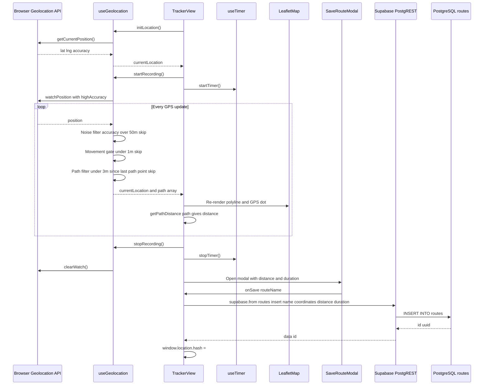

### 8.2 Mock GPS Simulator

When `isMockEnabled === true`, `useGeolocation` bypasses the browser Geolocation API entirely:
- Starts at a fixed seed point (`37.7749, -122.4194` — San Francisco).
- Every 2 seconds, increments lat/lng by `0.00008` (~8.9m NE diagonal).
- Enables laptop/desktop testing without real GPS hardware.

---

## 9. Feature: Route Sharing

### 9.1 Data Flow

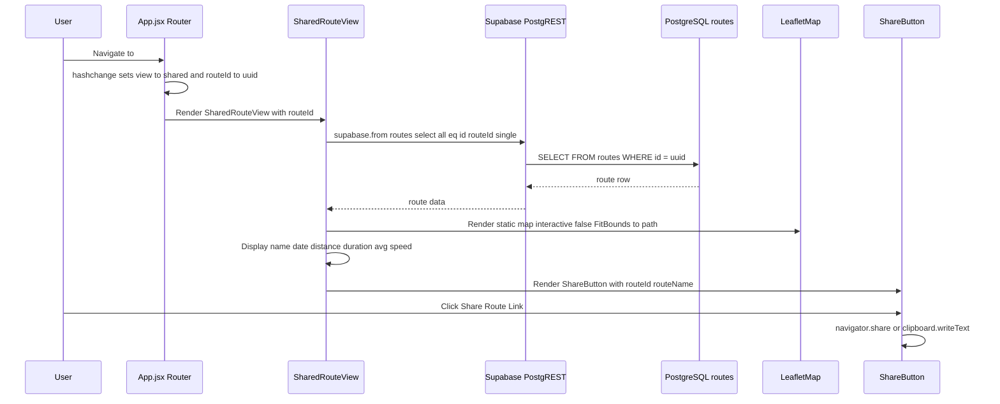

---

## 10. Feature: Nearby Places Discovery (POI)

### 10.1 End-to-End Data Flow

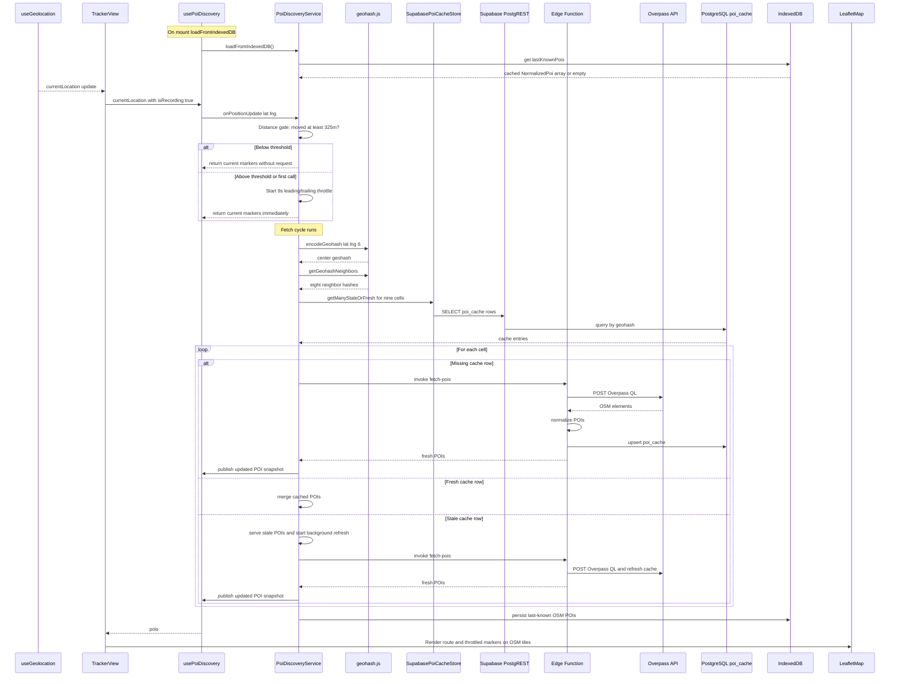

### 10.2 Throttle and Gate Logic

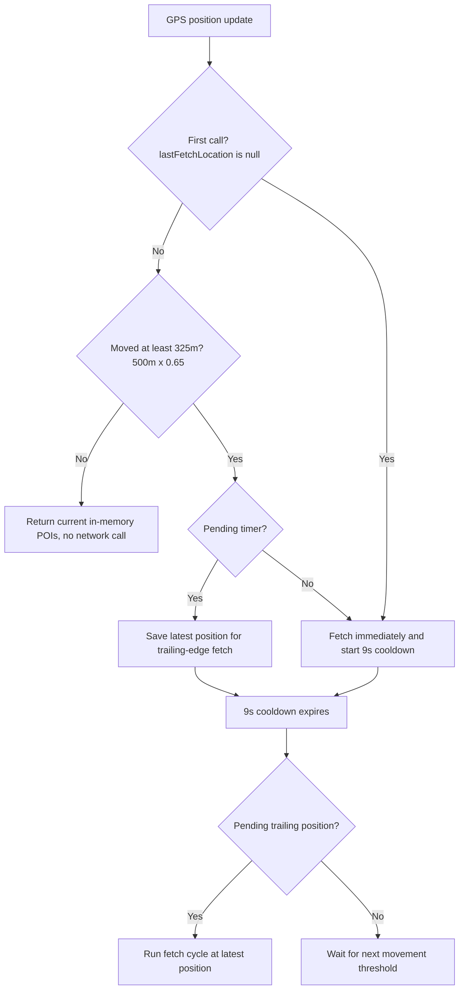

### 10.3 POI Module Files

| File | Class / Exports | Responsibility |
|---|---|---|
| `src/poi/poiConstants.js` | Constants | Radius (500m), movement threshold (0.65), fetch throttle (9s), render throttle (3s), geohash precision, cache TTL, OSM tags, category colors |
| `src/poi/poiTypes.js` | Cache and POI helpers | `NormalizedPoi`/`CachedPoiEntry` typedefs, TTL freshness check, OSM tag categories |
| `src/poi/SupabasePoiCacheStore.js` | `SupabasePoiCacheStore` | Read-only client adapter for the Edge Function-owned geohash cache |
| `src/poi/PoiDiscoveryService.js` | `PoiDiscoveryService` | Distance gate, fetch throttle, geohash cache reads, SWR updates, bounded OSM POI map, IndexedDB offline mirror |

---

## 11. Module Dependency Graphs

### 11.1 Full Import Graph

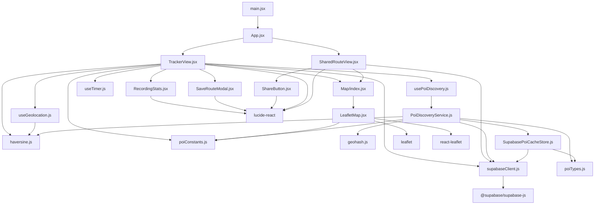

### 11.2 POI Module Internal Dependencies

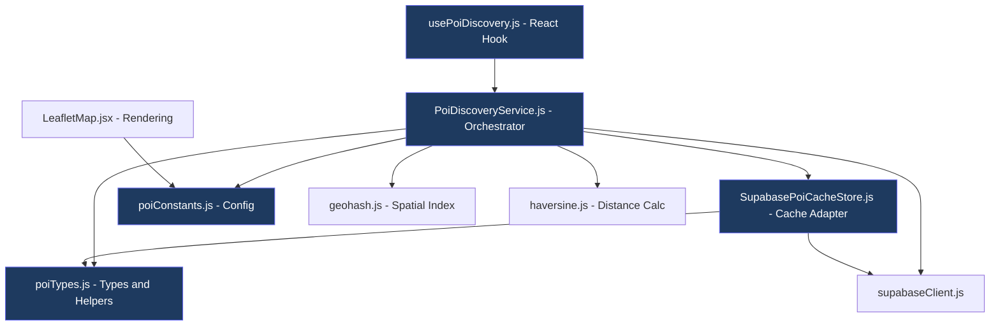

---

## 12. CI/CD Pipeline

Defined in `.github/workflows/deploy.yml`. Triggers on push to `main` or manual dispatch.

### 12.1 Pipeline Flow

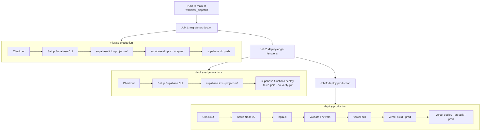

### 12.2 Job Dependencies

| Job | Depends On | Purpose |
|---|---|---|
| `migrate-production` | — | Applies pending SQL migrations to the Supabase PostgreSQL database |
| `deploy-edge-functions` | `migrate-production` | Deploys the `fetch-pois` Edge Function to the Supabase project |
| `deploy-production` | `migrate-production`, `deploy-edge-functions` | Builds the Vite SPA and deploys to Vercel |

### 12.3 Concurrency

```yaml
concurrency:
  group: production-deploy
  cancel-in-progress: false
```

All three jobs share a single concurrency group. A second push while a deploy is in-flight will **queue** (not cancel) the running deploy.

---

## 13. Environment Variables

### 13.1 Client-Side (Vite)

Set in `.env.local` (local dev) or injected by Vercel (production).

| Variable | Prefix | Required | Purpose |
|---|---|---|---|
| `VITE_SUPABASE_URL` | `VITE_` | Yes | Supabase project URL |
| `VITE_SUPABASE_PUBLISHABLE_KEY` | `VITE_` | Yes | Supabase anon/public key |

### 13.2 Edge Function (Deno Runtime)

Automatically injected by Supabase.

| Variable | Source | Purpose |
|---|---|---|
| `SUPABASE_URL` | Auto-injected | Supabase project URL for the admin client |
| `SUPABASE_SERVICE_ROLE_KEY` | Auto-injected / Dashboard | Writes normalized Overpass results to `poi_cache` |

### 13.3 CI/CD (GitHub Actions)

| Variable | Type | Used By |
|---|---|---|
| `SUPABASE_ACCESS_TOKEN` | Secret | `migrate-production`, `deploy-edge-functions` |
| `SUPABASE_DB_PASSWORD` | Secret | `migrate-production` |
| `VERCEL_TOKEN` | Secret | `deploy-production` |
| `SUPABASE_PROJECT_ID` | Var | `migrate-production`, `deploy-edge-functions` |
| `VERCEL_ORG_ID` | Var | `deploy-production` |
| `VERCEL_PROJECT_ID` | Var | `deploy-production` |
| `VITE_SUPABASE_URL` | Var | `deploy-production` (build-time) |
| `VITE_SUPABASE_PUBLISHABLE_KEY` | Var | `deploy-production` (build-time) |
