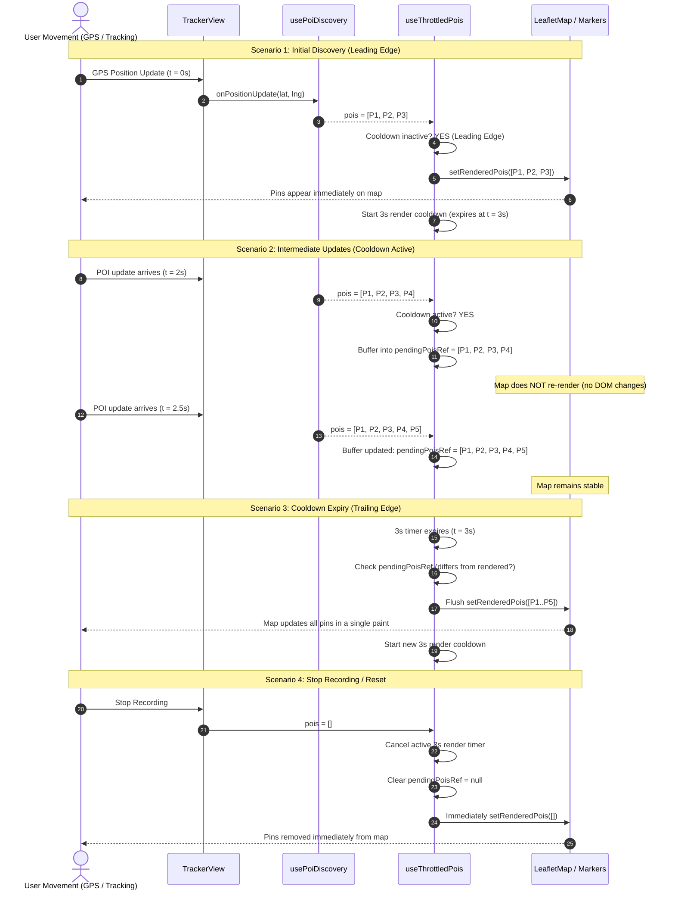

# Throttled POI Pin Rendering: Design, Changes, and Execution Flow

This document details the motivation, architectural changes, and step-by-step execution flow for the **Throttled Visual POI Pin Rendering** feature implemented on the interactive map.

---

## 1. Aim of the Changes

In active tracking mode, the user's geolocation updates continuously (typically at ~1Hz via HTML5 Geolocation or mock simulation). `PoiDiscoveryService` reads nearby geohash cache entries and refreshes them through the Supabase Edge Function when the movement gate and network throttle allow it. The app renders those results on Leaflet with OpenStreetMap tiles.

Prior to these changes:
* The map component rendered the raw `pois` array on every render cycle (`pois.map(...)`).
* Frequent GPS updates and map re-centers triggered constant React reconciliation and marker updates.
* This created **visual jitter**, **marker flicker**, and **unnecessary DOM thrashing** on mobile devices.

### Primary Objectives
1. **Decouple Data Fetching from Visual Rendering:** Keep the 9-second network fetch throttle independent from marker rendering.
2. **3-Second Render Throttle:** Ensure that visual markers refresh at most once every 3 seconds (`POI_RENDER_THROTTLE_INTERVAL_MS = 3000`).
3. **Leading + Trailing Edge Strategy:**
   * **Leading Edge:** Immediately display the first set of discovered POIs so the user never experiences a cold-start delay.
  * **Trailing Edge:** Ensure that POIs discovered during the 3-second render cooldown are flushed when the render timer expires.
4. **Immediate Cleanup:** Guarantee that pins and active timers clear instantly when tracking ends or the POI set is reset.

---

## 2. What Has Changed

### 2.1 File Changes & Additions

| File | Type | Description |
| :--- | :--- | :--- |
| [`src/hooks/useThrottledPois.js`](src/hooks/useThrottledPois.js) | **Added** | Custom React hook managing the 3-second leading + trailing edge render throttle, timer lifecycle, and order-independent identity checking (`arePoisEqual`). |
| [`src/components/Map/ThrottledPoiMarkers.jsx`](src/components/Map/ThrottledPoiMarkers.jsx) | **Updated** | Leaflet marker component consuming `useThrottledPois`. |
| [`src/components/Map/renderThrottledPoiMarkers.jsx`](file:///Users/koushikdebnath/my-path/src/components/Map/renderThrottledPoiMarkers.jsx) | **New** | Functional helper providing a clean functional API to render throttled markers within JSX map trees. |
| [`src/components/Map/LeafletMap.jsx`](src/components/Map/LeafletMap.jsx) | **Current** | Renders OSM tiles and throttled Leaflet POI markers. |

### 2.2 Visual Pin Specifications Preserved
The visual presentation of the markers remains fully intact:
* **Pin Marker Dot (`.poi-marker-dot`):** 14×14px circular element with category-driven theme color (`--poi-color`), subtle border, and radial glow box shadow.
* **Interactive Hover Effect:** Hover scales the pin by 135% (`transform: scale(1.35)`) and displays a glassmorphic tooltip badge (`.poi-marker-label`) showing the sanitized POI name.
* **Category Color Palette:** Amber (tourism), purple (historic), emerald (park), orange (cafe), red (restaurant), blue (default).

---

## 3. Architecture & Execution Flow



---

## 4. Step-by-Step Execution Lifecycle

### Phase 1: Leading Edge Execution (Cold Start)
1. Tracking begins; `currentLocation` triggers `usePoiDiscovery`.
2. POIs arrive from the geohash cache or an Overpass refresh.
3. `useThrottledPois` receives the new `pois` array.
4. `throttleTimerRef.current` is `null` (no cooldown active).
5. The hook executes the **leading edge**:
   * Schedules immediate state update (`setRenderedPois(safePois)` via microtask).
   * Spawns a `setTimeout` cooldown for `intervalMs` (9,000ms).
6. Leaflet renders the `<Marker>` elements immediately.

### Phase 2: Active Cooldown & Buffering (0s < t < 3s)
1. User moves; GPS coordinate changes every second.
2. `usePoiDiscovery` updates its internal snapshot and pushes updated `pois` arrays.
3. `useThrottledPois` checks `throttleTimerRef.current !== null`.
4. The hook suppresses visual re-renders and stores the latest array into `pendingPoisRef.current`.
5. No marker-state changes occur during the window; Leaflet avoids repeated marker updates.

### Phase 3: Trailing Edge Execution (t = 3s)
1. The 3-second timer callback fires.
2. `throttleTimerRef.current` is set to `null`.
3. The hook inspects `pendingPoisRef.current`:
   * If `null` or identical to current pins (`arePoisEqual`), no update occurs.
   * If new POIs accumulated during the cooldown:
     * `setRenderedPois(nextPois)` updates the map.
     * `pendingPoisRef.current` is cleared.
    * A new 3-second cooldown timer is scheduled to throttle subsequent display updates.

### Phase 4: Identity Guard (`arePoisEqual`)
* React parent components (e.g. `TrackerView`) often re-render due to timer ticks (`elapsedTime`), distance calculations, or center adjustments.
* Even if a parent re-renders and passes a fresh array reference for `pois`, `arePoisEqual(lastRenderedRef.current, safePois)` performs an ID check (`poi.id`).
* If the IDs have not changed, the effect exits early, preventing spurious timer resets or render cycles.

### Phase 5: Teardown & Immediate Reset
* When the user finishes or cancels a route, `isRecording` becomes `false`.
* `usePoiDiscovery` empties `pois` (`[]`).
* When `safePois.length === 0`:
  * Any running `throttleTimerRef` is cleared via `clearTimeout`.
  * `pendingPoisRef.current` is nullified.
  * `setRenderedPois([])` is invoked immediately (no 9-second wait).
  * Pins disappear synchronously with the end of recording.

---

## 5. Edge Cases That Could Break Things & Remedies

### 5.1 Dual Throttle Stacking

**Edge case:** Network requests and visual marker changes have independent throttles:

| Layer | Location | Purpose |
| :--- | :--- | :--- |
| Fetch throttle | [`PoiDiscoveryService.js:L116-L130`](file:///Users/koushikdebnath/my-path/src/poi/PoiDiscoveryService.js#L116-L130) | Limits API calls to the edge function |
| Render throttle | [`src/hooks/useThrottledPois.js`](src/hooks/useThrottledPois.js) | Limits React re-renders of map markers to once per 3 seconds |

With a 3-second render interval, the marker layer drains updates before the next 9-second network cycle rather than adding a second 9-second delay.

---

### 5.2 `arePoisEqual` Is Order-Sensitive — Non-Deterministic Providers Defeat the Guard

**Edge case:** The identity guard in [`useThrottledPois.js:L13-L14`](file:///Users/koushikdebnath/my-path/src/hooks/useThrottledPois.js#L13-L14) compares POI IDs positionally:
```js
for (let i = 0; i < a.length; i++) {
  if (a[i]?.id !== b[i]?.id) return false;
}
```

POIs may be merged from multiple geohash cache cells in differing orders. Two arrays with the same IDs in different orders should not trigger a marker rebuild.

**Current implementation:** The positional comparison has been replaced with a **Set-based ID check**:
```js
export function arePoisEqual(a = [], b = []) {
  if (a === b) return true;
  if (!a || !b || a.length !== b.length) return false;
  const ids = new Set(a.map(p => p.id));
  return b.every(p => ids.has(p.id));
}
```
This makes equality independent of array ordering while preserving the O(n) performance profile.

---

### 5.3 Background Cache Refresh Not Propagated to React

**Edge case:** A stale-while-revalidate Overpass request can complete after the last GPS event.

**Remedy:** `PoiDiscoveryService` publishes updates through `onPoisUpdated`, and `usePoiDiscovery` subscribes and cleans up on unmount. Background revalidation keeps stationary users' markers current.

---

### 5.4 Throttle Hook Runs Unnecessarily on Non-Interactive Static Views

**Edge case:** `renderThrottledPoiMarkers` is called unconditionally in `LeafletMap.jsx`. On static shared-route views, the marker component mounts and returns `null` because `interactive=false`.

**Result:** Wasted hook allocation on every render of a shared/saved route view. Not a crash, but unnecessary overhead.

**Remedy:** Restore the short-circuit guard at the call site:
```jsx
{/* POI markers — rendered via 3s throttle logic */}
{interactive && renderThrottledPoiMarkers(pois, {
  interactive,
  intervalMs: poiThrottleIntervalMs,
})}
```
This prevents the component from mounting at all when `interactive` is `false`.

---

### 5.5 OSM Cache Cutover

The Overpass Edge Function writes normalized OSM POIs to `poi_cache` by geohash with the configured TTL. Client code reads the table but cannot write to it. IndexedDB stores the last-known normalized OSM POI array for offline fallback.

---

### 5.6 `queueMicrotask` State Updates May Cause Stale Closure Reads

**Edge case:** The leading-edge and reset paths in [`useThrottledPois.js:L52-L54`](file:///Users/koushikdebnath/my-path/src/hooks/useThrottledPois.js#L52-L54) and [`L64-L66`](file:///Users/koushikdebnath/my-path/src/hooks/useThrottledPois.js#L64-L66) defer `setRenderedPois` via `queueMicrotask`. This was done to satisfy the React 19 ESLint rule against synchronous `setState` inside effects. However, microtasks execute after the current effect but before the next paint — and the closure captures `safePois` at the time the effect ran. If React batches multiple effect runs before the microtask drains, the deferred `setRenderedPois` may write a stale reference.

**Result:** Under heavy rapid updates (e.g., fast GPS simulation), the rendered state could briefly show an outdated POI snapshot that is overwritten on the next cycle. Not a crash, but a potential flicker.

**Remedy:** Use `setRenderedPois` with a functional updater or move the state update to a `useCallback` triggered outside the effect body. Alternatively, since the trailing-edge path already uses `setRenderedPois` synchronously inside a `setTimeout` callback (which is exempt from the lint rule), consider the same approach for the leading edge.

---

### 5.7 Category Mapping

OSM tags are mapped to the app's marker categories in the Edge Function. The map uses `default` as a defensive fallback for unrecognized tags.
